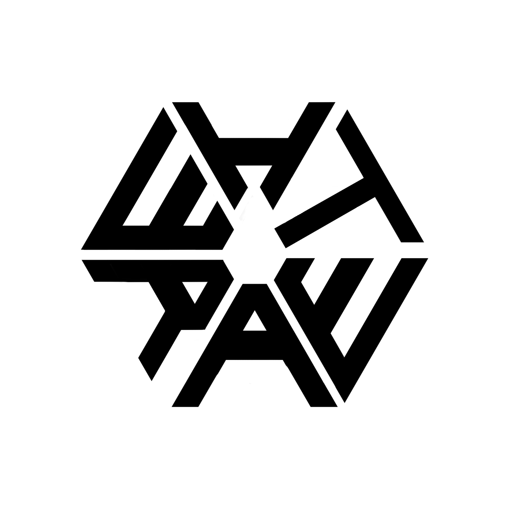

<!-- Improved compatibility of back to top link: See: https://github.com/othneildrew/Best-README-Template/pull/73 -->
<a id="readme-top"></a>
<!--
*** Thanks for checking out the Best-README-Template. If you have a suggestion
*** that would make this better, please fork the repo and create a pull request
*** or simply open an issue with the tag "enhancement".
*** Don't forget to give the project a star!
*** Thanks again! Now go create something AMAZING! :D
-->


<!-- PROJECT SHIELDS -->
<!--
*** I'm using markdown "reference style" links for readability.
*** Reference links are enclosed in brackets [ ] instead of parentheses ( ).
*** See the bottom of this document for the declaration of the reference variables
*** for contributors-url, forks-url, etc. This is an optional, concise syntax you may use.
*** https://www.markdownguide.org/basic-syntax/#reference-style-links
-->
[![Contributors][contributors-shield]][contributors-url]
[![Forks][forks-shield]][forks-url]
[![Stargazers][stars-shield]][stars-url]
[![Issues][issues-shield]][issues-url]


<!-- PROJECT LOGO -->
<br />
<div align="center">
  <a href="https://github.com/Whatever0rg/AetherUnit">
    
  </a>

<h3 align="center">AetherUnit</h3>

  <p align="center">
    project_description
    <br />
    <a href="https://github.com/Whatever0rg/AetherUnit"><strong>Explore the docs »</strong></a>
    <br />
    <br />
    <a href="https://github.com/Whatever0rg/AetherUnit">View Demo</a>
    ·
    <a href="https://github.com/Whatever0rg/AetherUnit/issues/new?labels=bug&template=bug-report---.md">Report Bug</a>
    ·
    <a href="https://github.com/Whatever0rg/AetherUnit/issues/new?labels=enhancement&template=feature-request---.md">Request Feature</a>
  </p>
</div>


<!-- TABLE OF CONTENTS -->
<details>
  <summary>Table of Contents</summary>
  <ol>
    <li>
      <a href="#about-the-project">About The Project</a>
      <ul>
    <li>
      <a href="#getting-started">Getting Started</a>
      <ul>
        <li><a href="#prerequisites">Prerequisites</a></li>
        <li><a href="#installation">Installation</a></li>
      </ul>
    </li>
    <li><a href="#usage">Usage</a></li>
    <li><a href="#roadmap">Roadmap</a></li>
    <li><a href="#contributing">Contributing</a></li>
    <li><a href="#license">License</a></li>
    <li><a href="#contact">Contact</a></li>
    <li><a href="#acknowledgments">Acknowledgments</a></li>
  </ol>
</details>


<!-- ABOUT THE PROJECT -->
## About The Project

[![Product Name Screen Shot][product-screenshot]](https://example.com)

The AetherUnit is a projekt I developed and created for a technical exam.
It record data every 15 minutes, but that can be adjusted in the main.cpp.
The recorded Data is composed of Temperature, Humidity, Pressure, CO2 and TVOC.
All this data is saved on a microSD-Card, formated as an CSV, because it was the easiest for me to implement.
The whole idea for this project is to help the user to track their airquality inside the room or office.-Use cases may vary-
The current iteration has no live display nor a GUI, this might be added on a later date. - A-levels are coming up - 

<p align="right">(<a href="#readme-top">back to top</a>)</p>


<!-- GETTING STARTED -->
## Getting Started
For a base Module you need:
- An Arduino UNO R3 (or similar)
- A BME 280
- A CCS 811


### Installation

1. Clone the repo
   ```sh
   git clone https://github.com/Whatever0rg/AetherUnit.git
   ```
2. Build version using platformio.ini
    U
3. Connect Arduino and upload version using paltformio.ini
  

<p align="right">(<a href="#readme-top">back to top</a>)</p>


<!-- USAGE EXAMPLES -->
## Usage

Use this space to show useful examples of how a project can be used. Additional screenshots, code examples and demos work well in this space. You may also link to more resources.

_For more examples, please refer to the [Documentation](https://example.com)_

<p align="right">(<a href="#readme-top">back to top</a>)</p>


<!-- ROADMAP -->
## Roadmap

- [ ] GUI; Webinterface
- [ ] GUI; Analog


See the [open issues](https://github.com/Whatever0rg/AetherUnit/issues) for a full list of proposed features (and known issues).

<p align="right">(<a href="#readme-top">back to top</a>)</p>


<!-- CONTRIBUTING -->
## Contributing

Contributions are what make the open source community such an amazing place to learn, inspire, and create. Any contributions you make are **greatly appreciated**.

If you have a suggestion that would make this better, please fork the repo and create a pull request. You can also simply open an issue with the tag "enhancement".
Don't forget to give the project a star! Thanks again!

1. Fork the Project
2. Create your Feature Branch (`git checkout -b feature/AmazingFeature`)
3. Commit your Changes (`git commit -m 'Add some AmazingFeature'`)
4. Push to the Branch (`git push origin feature/AmazingFeature`)
5. Open a Pull Request

<p align="right">(<a href="#readme-top">back to top</a>)</p>

### Top contributors:

<a href="https://github.com/Whatever0rg/AetherUnit/graphs/contributors">
  
</a>


<!-- LICENSE -->
## License

TBA

<p align="right">(<a href="#readme-top">back to top</a>)</p>


<!-- CONTACT -->
## Contact

Bennet H. - bennet@hfjn.de

Project Link: [https://github.com/Whatever0rg/AetherUnit](https://github.com/Whatever0rg/AetherUnit)

<p align="right">(<a href="#readme-top">back to top</a>)</p>


<!-- ACKNOWLEDGMENTS -->
## Acknowledgments

* []()
* []()
* []()

<p align="right">(<a href="#readme-top">back to top</a>)</p>


<!-- MARKDOWN LINKS & IMAGES -->
<!-- https://www.markdownguide.org/basic-syntax/#reference-style-links -->
[contributors-shield]: https://img.shields.io/github/contributors/Whatever0rg/AetherUnit.svg?style=for-the-badge
[contributors-url]: https://github.com/Whatever0rg/AetherUnit/graphs/contributors
[forks-shield]: https://img.shields.io/github/forks/Whatever0rg/AetherUnit.svg?style=for-the-badge
[forks-url]: https://github.com/Whatever0rg/AetherUnit/network/members
[stars-shield]: https://img.shields.io/github/stars/Whatever0rg/AetherUnit.svg?style=for-the-badge
[stars-url]: https://github.com/Whatever0rg/AetherUnit/stargazers
[issues-shield]: https://img.shields.io/github/issues/Whatever0rg/AetherUnit.svg?style=for-the-badge
[issues-url]: https://github.com/Whatever0rg/AetherUnit/issues
[license-shield]: https://img.shields.io/github/license/Whatever0rg/AetherUnit.svg?style=for-the-badge
[license-url]: https://github.com/Whatever0rg/AetherUnit/blob/master/LICENSE.txt
[linkedin-shield]: https://img.shields.io/badge/-LinkedIn-black.svg?style=for-the-badge&logo=linkedin&colorB=555
[linkedin-url]: https://linkedin.com/in/linkedin_username
[product-screenshot]: images/screenshot.png
[Next.js]: https://img.shields.io/badge/next.js-000000?style=for-the-badge&logo=nextdotjs&logoColor=white
[Next-url]: https://nextjs.org/
[React.js]: https://img.shields.io/badge/React-20232A?style=for-the-badge&logo=react&logoColor=61DAFB
[React-url]: https://reactjs.org/
[Vue.js]: https://img.shields.io/badge/Vue.js-35495E?style=for-the-badge&logo=vuedotjs&logoColor=4FC08D
[Vue-url]: https://vuejs.org/
[Angular.io]: https://img.shields.io/badge/Angular-DD0031?style=for-the-badge&logo=angular&logoColor=white
[Angular-url]: https://angular.io/
[Svelte.dev]: https://img.shields.io/badge/Svelte-4A4A55?style=for-the-badge&logo=svelte&logoColor=FF3E00
[Svelte-url]: https://svelte.dev/
[Laravel.com]: https://img.shields.io/badge/Laravel-FF2D20?style=for-the-badge&logo=laravel&logoColor=white
[Laravel-url]: https://laravel.com
[Bootstrap.com]: https://img.shields.io/badge/Bootstrap-563D7C?style=for-the-badge&logo=bootstrap&logoColor=white
[Bootstrap-url]: https://getbootstrap.com
[JQuery.com]: https://img.shields.io/badge/jQuery-0769AD?style=for-the-badge&logo=jquery&logoColor=white
[JQuery-url]: https://jquery.com 
